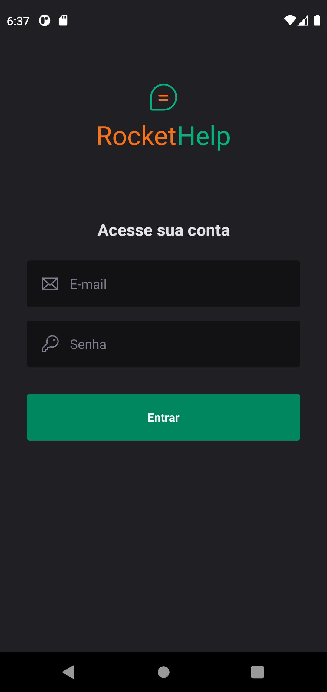

# RocketHelp

Desenvolver uma aplicação completa com React Native e outras tecnologias, no **Ignite Lab React Native**.

## 🚀 Tecnologias

Esse projeto foi desenvolvido com as seguintes tecnologias:

- <a href="https://react-native.rocketseat.dev/">React Native</a> 
- Typescript
- Expo
- Native Base
- Android Studio
- <a href="https://firebase.google.com">Firebase</a>
- ...🏗️

## 💻 Projeto

Construção de um Aplicativo Mobile com função de organizar pedidos de menutenção usando React Native

> &emsp; &emsp; 
> &emsp; &emsp; 

## :memo: Licença

Esse projeto está sob a licença MIT.

---

A IgniteLab é um evento de conteúdos gratuitos voltados para programação, promovido pela *@Rocketseat*.